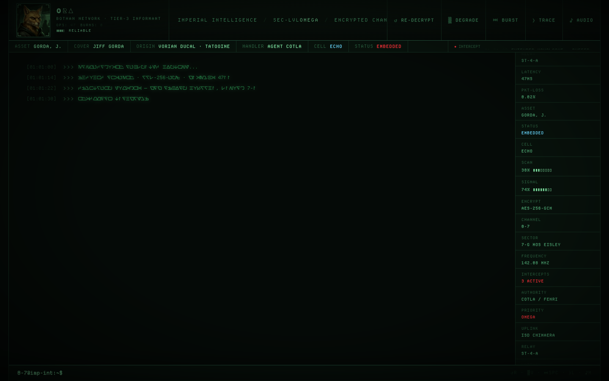

<p align="center">
  
</p>

# SWG Infinity on Mac

Step-by-step guide for running [SWG Infinity](https://www.swginfinity.com/) on macOS via [Sikarugir](https://github.com/Sikarugir-App/Sikarugir)—a free, open-source Wine wrapper with built-in DirectX-to-Metal translation.

SWG Infinity is a pre-CU Star Wars Galaxies private server—the ideal version of the MMO, before SOE destroyed it with the New Game Experience in 2005. The launcher and client are Windows-only, but Wine-based compatibility layers run them on Mac. CodeWeavers rates SWG as **"Runs Great"** on macOS.

## Prerequisites

- macOS Sonoma (14.0) or newer
- Apple Silicon (M1/M2/M3/M4) or Intel Mac
- ~15 GB free disk space (Sikarugir + game data)
- [SWG Infinity account](https://my.swginfinity.com/) (free)

## Install Sikarugir

[Sikarugir](https://github.com/Sikarugir-App/Sikarugir) is a free Wine wrapper for macOS—the successor to Whisky (now discontinued). It creates native `.app` wrappers around Wine prefixes with built-in DXMT (DirectX-to-Metal) for better GPU performance on Apple Silicon.

```bash
brew install --cask Sikarugir-App/sikarugir/sikarugir
```

On Apple Silicon Macs, install Rosetta 2 if you haven't already:

```bash
softwareupdate --install-rosetta --agree-to-license
```

### Why Sikarugir over CrossOver?

- **Free.** CrossOver costs ~$74 after the 14-day trial.
- **DXMT built-in.** DirectX-to-Metal translation gives better GPU performance than CrossOver's default D3DMetal/MoltenVK pipeline.
- **Native Mac apps.** Each game gets its own `.app` wrapper—double-click to launch, shows up in the Dock.
- **Same engine.** Both use Wine under the hood. SWG runs identically.

## Create a wrapper

1. Open **Sikarugir Creator.app** from your Applications folder
2. Click **Download Template** and wait for it to finish
3. Set the engine to **WS12WineSikarugir10.0_4** (or the latest available)
4. Click **Create**
5. Name it **SWG Infinity**
6. Save it to your Applications folder
7. When the popup appears, select **Launch It**

You'll see the Configure app. Enable **DirectX to Metal translation layer (DXMT)**.

## Install DirectX

SWG uses DirectX 9. Wine needs the June 2010 DirectX redistributable installed manually.

1. Download the [DirectX June 2010 redistributable](https://www.microsoft.com/en-gb/download/details.aspx?id=8109) (`directx_Jun2010_redist.exe`)
2. In the Configure app, click **Install Software**
3. Select `directx_Jun2010_redist.exe`—this is an extractor, not the real installer
4. A popup may say "Maybe the installer failed?"—ignore it, click **OK**
5. Switch to the installer in your Dock
6. Click **Yes**, set the extraction location to `C:\DirectX`, click **OK**
7. Back in the Configure app, click **Install Software** again
8. Navigate into the new `DirectX` folder and select **DXSETUP.exe**
9. Ignore the "Maybe the installer failed?" popup again—go to the installer in the Dock
10. Click **Accept → Next → Next → Finish**

## The `swg` CLI

This repo includes a unified CLI that replaces the Windows launcher entirely—download, authenticate, audit, configure, and launch the game from a single command.

### Install

```bash
make install    # symlinks bin/swg → ~/bin/swg
```

### Commands

| Command | Description |
|---------|-------------|
| `swg launch [--login]` | Full diagnostic audit + Wine launch. `--login` runs auth first. |
| `swg login [--save] [--forget]` | Authenticate with MFA, write config files. `--save` stores credentials in macOS Keychain. |
| `swg download [--target dir]` | Download game files from patch server (51 files, ~5.6 GB, MD5-verified) |
| `swg audit` | Validate config files, `.tre` references, plist flags—exit 0 if clean |
| `swg status` | Show Wine version, active renderer, file counts, server reachability |
| `swg config [key [value]]` | Read/write Sikarugir plist flags (DXMT, WINEESYNC, etc.) |
| `swg winetricks <verb>` | Install components via the wrapper's winetricks |
| `swg shell` | Open subshell with `WINEPREFIX` and Wine env vars set |
| `swg kill` | Kill the wineserver |

The original standalone scripts (`launch.sh`, `login.sh`, `download-game.sh`) are now shims that delegate to the CLI—backward compatible.

### Zsh completions

Tab completion is installed automatically with `make install` if `~/.zsh/completions/` exists, or source it manually:

```bash
source completions/swg.zsh
```

## Get the game files

### The launcher problem

The SWG Infinity launcher is a Tauri app that uses Microsoft Edge WebView2 for its UI. WebView2's COM initialization crashes under Wine with a page fault in `ole32.dll`—this is a fundamental Wine compatibility issue, not a missing dependency. Installing the WebView2 runtime, Visual C++ redistributables, or other components does not fix it.

This means **the launcher won't work under Wine**. You need to get the game files another way.

### Option A—`swg download` (recommended)

The game files are hosted on SWG Infinity's public patch server. The CLI pulls them directly—no launcher, no Windows machine, no VM.

```bash
swg download
```

This fetches the manifest from `https://updater.swginfinity.com/manifest.json`, downloads all 51 files (~5.6 GB), and verifies each file's MD5 hash. Downloads are resumable—run it again and it skips files that already pass verification.

Files land in `./game-files/` by default, or pass a custom path:

```bash
swg download --target ~/Applications/Sikarugir/SWG\ Infinity.app/Contents/SharedSupport/prefix/drive_c/SWG\ Infinity
```

### Option B—Copy from a Windows machine

If you or a friend have a working Windows install of SWG Infinity:

1. Copy the entire game directory (typically `C:\Games\SWGInfinity\`, ~5–10 GB)
2. Place the files inside your Sikarugir wrapper's virtual C: drive at `C:\SWG Infinity\`
   - The wrapper's filesystem lives at `~/Applications/SWG Infinity.app/Contents/SharedSupport/prefix/drive_c/`

### Option C—Ask the SWG Infinity Discord

Join the [SWG Infinity Discord](https://discord.gg/swginfinity) and ask in the support or Linux channels for help from other Mac/Linux players who've solved this.

## Configure and launch

Once you have the game files in your wrapper:

### Authenticate

The launcher normally handles login and config generation. Since we bypass it:

```bash
swg login --save    # first time — stores credentials in macOS Keychain
swg login           # subsequent — auto-uses stored credentials
```

This authenticates via MFA (check your email for the code), writes `swgemu_login.cfg` with server connection details, generates `swgemu.cfg` with the correct include chain, and patches `swgemu_live.cfg` with base `.tre` entries (`bottom.tre`, `infinity_xmas.tre`).

Credentials are stored in the macOS Keychain (encrypted, not plaintext). Run `swg login --forget` to remove them.

### Launch

Sikarugir's built-in launcher uses Wine's `start.exe`, which doesn't set the working directory to the game folder. SWG requires CWD = game directory because `.tre` paths in the config are relative:

```bash
swg launch           # Launch the game
swg launch --login   # Authenticate first, then launch
```

This runs Wine directly with the correct CWD, sets `DYLD_FALLBACK_LIBRARY_PATH` for Wine's dylib dependencies, captures full crash diagnostics, and detects crash dumps.

### First launch

- First time setup will ask you to set graphics options
- Enable **Windowed** and **Borderless** for best macOS experience
- Start with moderate settings and increase—SWG's DirectX 9 renderer translates well through DXMT

## Troubleshooting

### `defaultappearance.apt could not be found` (int3 crash)

This Fatal crash means the game's TreeFile system can't find base assets. The file exists inside `mtg_patch_002_appearance_02.tre`—the problem is the config parser losing track of which `.tre` files to load.

**Root cause:** the SWG config parser **replaces** duplicate INI sections instead of merging them. If `bottom.tre` and `infinity_xmas.tre` are in a separate `swgemu_preload.cfg` with its own `[SharedFile]` header, and that file is included after `swgemu_live.cfg`, the second `[SharedFile]` section wipes out all 25 patch `.tre` entries from the first. The game then only sees 2 of 27 archives.

**Fix:** run `swg login`—it patches the base `.tre` entries directly into `swgemu_live.cfg`'s `[SharedFile]` section. If you previously created a `swgemu_preload.cfg`, delete it and remove its `.include` line from `swgemu.cfg`.

### CWD / libinotify crashes

Use `swg launch` instead of double-clicking the wrapper. The CLI sets the correct working directory (SWG needs CWD = game directory for relative `.tre` paths) and `DYLD_FALLBACK_LIBRARY_PATH` for Wine's dylib dependencies.

### Anticheat (Sentinel)

SWG Infinity uses a custom anticheat called Sentinel—DLL injection, not kernel-level like EAC or BattlEye. Wine/CrossOver handles this fine. Linux players confirm it works. If you're launching the client directly (bypassing the launcher), Sentinel may not load automatically—ask in Discord whether you need to launch through a specific wrapper script.

### Performance tips

- **DXMT enabled**: Make sure DirectX-to-Metal is toggled on in the Configure app. This is the biggest performance lever on Apple Silicon.
- **Graphics settings**: SWG's renderer is DirectX 9, which Wine translates well. Start moderate and increase.
- **Disable overlays**: Discord overlay and similar tools can conflict—disable them if you see crashes.
- **Weird FPS limit**: If the game runs at 120fps with VSync on (should be 60fps), the SWG Restoration community recommends ReShade to enforce the cap. Run in windowed/borderless to avoid recompilation on tab-out.

### Alternative: CrossOver (paid)

[CrossOver](https://www.codeweavers.com/crossover) ($74, 14-day trial) is the commercial Wine wrapper. It works the same as Sikarugir for running the game client—you'd still need to bypass the Tauri launcher. The main advantage is CodeWeavers' support team and automated dependency management. Install via `brew install --cask crossover`.

### Alternative: Boot Camp (Intel Macs only)

If you're on an Intel Mac, Boot Camp (dual-booting into Windows) gives native performance with zero compatibility concerns. Requires a reboot every time you play.

## Links

- [SWG Infinity](https://www.swginfinity.com/)—server homepage
- [SWG Infinity Discord](https://discord.gg/swginfinity)—primary community support, Mac/Linux players active
- [My Account](https://my.swginfinity.com/)—create/manage your game account
- [Sikarugir](https://github.com/Sikarugir-App/Sikarugir)—free Wine wrapper for macOS
- [SWG on CrossOver](https://www.codeweavers.com/compatibility/crossover/star-wars-galaxies)—CodeWeavers compatibility page (rated "Runs Great")
- [SWG Restoration macOS Guide](https://swgr.org/wiki/non_windows_install/)—detailed guide for another SWG server (same game engine, similar setup)

---

## Why this repo exists

This guide exists because no one else has written a definitive Mac setup walkthrough for SWG Infinity. The closest resources are a Reddit post for Ubuntu/Wine and CodeWeavers' generic compatibility entry. We wanted something our friends could follow cold.

It also connects to a longer history with the game.

### Project Thorn—Jiff Gorda intercept demo

In 2003–2005, I played Star Wars Galaxies on the Starsider server as **Vorian Ducal**—a Nagai intelligence operative—and his cover identity **Jiff Gorda**, a human smuggler embedded on Tatooine. The character bios, short stories, and forum roleplay from that era survived in `.doc` files for twenty years.

In 2026, those documents became **Project Thorn**: an interactive Imperial Intelligence terminal that performs the original Jiff Gorda bio as a live Aurebesh-encrypted intercept, complete with audio cues, a holographic dossier modal, and a functional terminal emulator with 25+ commands. Single HTML file, no build step.




The demo is included in this repo at [`demos/project-thorn/`](demos/project-thorn/)—just open `index.html`.

Twenty years from forum roleplay to an Imperial terminal. Now back to the game itself.

---

## Quick reference

For a condensed step-by-step of the exact setup process (no explanations, just commands), see [`setup-steps.md`](setup-steps.md).

## Repo structure

```
swg-infinity/
├── bin/swg                     # CLI entry point
├── lib/
│   ├── swg-core.sh             # Shared constants, logging, plist helpers
│   ├── swg-wine.sh             # Wine env, exe invocation, crash diagnostics
│   ├── swg-audit.sh            # Config + TRE file validation
│   ├── swg-auth.sh             # Auth flow, MFA, config writing
│   ├── swg-download.sh         # Manifest fetch, file download, MD5 verify
│   └── swg-manage.sh           # Status, config, winetricks subcommands
├── completions/swg.zsh         # Zsh tab completions
├── Makefile                    # install/uninstall
├── launch.sh                   # Shim → swg launch
├── login.sh                    # Shim → swg login
├── download-game.sh            # Shim → swg download
├── README.md                   # This file
├── CLAUDE.md                   # Agent docs
├── setup-steps.md              # Condensed setup commands
├── infrastructure.md           # Launcher internals, server infra, auth flow
└── demos/project-thorn/        # Imperial Intelligence terminal demo
```
